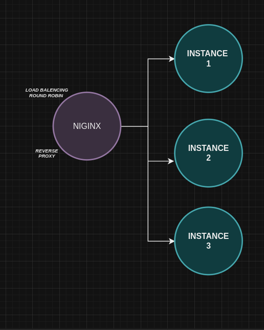

## prevena-backend

### Project Overview

The Pinktober Hackathon Backend is a Go-based API server that performs product and ingredient risk analysis. Users can fetch product details, analyze ingredients in products for risk factors, and interact with various API endpoints for managing products and ingredients.

### Technologies

- Golang
- MongoDB
- Mux
- Docker
- Makefile

### Architecture

- Models: Represent the structure of products and ingredients stored in MongoDB.
- DTO (Data Transfer Objects): Used to transfer data between the service and the client.
- Handlers: HTTP request handlers for routing.
- Repositories: Manage database interaction, including querying and seeding MongoDB collections.
  Services: Business logic for processing data (e.g., analyzing ingredient risk).




### Features

- Product Management: Create, fetch, and search products by barcode.
- Ingredient Analysis: Analyze ingredient lists and return risk scores and types.
- Paginated API Responses: Support for paginated product fetching.
- Database Seeding: Seed initial product and ingredient data.
- Swagger API Documentation: Automatically generated API docs using Swagger.

### API Endpoints

#### Products

- GET /products?page={page}&per_page={perPage}: Fetch paginated products.
- GET /product/{barcode}: Fetch product details by barcode.
- POST /analyze: Analyze product ingredients for risk factors.
- POST /seed: Seed products into the database.

#### Swagger

- GET /swagger/doc.yaml: Serve Swagger YAML documentation.
- GET /swagger-ui: Swagger UI to interact with the API.

### Installation

1. Clone this repository:

   ```bash
   git clone https://github.com/edaywalid/prevena-backend
   cd prevena-backend
   ```

2. Run the project

   ```bash
       go mod tidy
       make run-instance
   ```

### Swagger documentation

```bash
    http://localhost:8080/swagger/index.html
```
